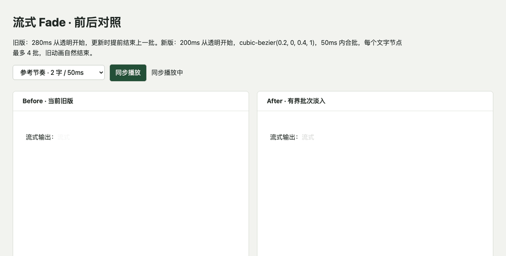

# Vue 3 流式 fade 对比

基线：`52b774767e2f038283bd64a908f34b94588a6301`。测量时间：2026-09-09T03:26:10.568Z。

## 最终配置与行为

旧版默认 280ms、透明度 0 → 1；后续更新会把上一批直接归入完全可见文本。新版采用调试页确认的 **200ms、透明度 0 → 1、`cubic-bezier(0.2, 0, 0.4, 1)`**，50ms 窗口内合批，每个文字节点最多 4 个批次。

批次的 DOM 和动画身份保持稳定；达到上限时追加到最新批次，因此极密集输入的新字可能继承该批次当前透明度。没有额外出字队列、逐字 span、测速循环或 JS 动画帧循环。50ms 是合批窗口，不会延迟文字接收；每 50ms 出 2 字只是对照输入场景，不是库新增的输出限速。已有 CSS duration/ease 变量仍然生效。

在真实 Chrome 中暂停动画、设置时间点后追加文字：50ms 时旧版从 8.5% 突然变为 100%，新版约 32.4% → 32.4%；100ms 时旧版 29.2% → 100%，新版约 71.8% → 71.8%。新版保持同一动画。这是受控透明度采样，不是用户偏好评分。

活跃批次自然完成后合并为静态文本。选中文字时保留选区，释放后补齐内容。reduced-motion 下用 0s 动画立即显示并完成清理。TextNode / InlineCodeNode 不再监听全局流式版本。

## 视觉对照

依次展示参考节奏、慢速、快速；两侧使用同一输入，右侧使用最终库默认值。录屏与性能测量分开执行。



## 性能

环境：152.0.7977.83, darwin/arm64, headless, production builds, 1100×800, no CPU throttling。前后版本单独运行；3 次交替顺序取中位数。测试、lint、构建和 playground 验证在计时前结束，调试页循环暂停。`smoothStreaming=false` 隔离 fade，初始化和预热不在计时区间。

主线程为整段流式过程加最后 400ms 清理窗口的 CDP TaskDuration，包含相同测试采样代码，不含 GPU 时间；不是每帧耗时。内存为 GC 后保留的 JS 堆，不是峰值内存。

| 场景 | 旧版主线程 ms | 新版主线程 ms | 变化 | 新版关闭 fade ms | 帧间隔 p95 旧/新 ms | GC 后 JS 堆旧/新 KB |
|---|---:|---:|---:|---:|---:|---:|
| 参考节奏 · 2 字 / 50ms | 396.6 | 490.7 | +23.7% | 349.8 | 16.7 / 16.8 | 4810 / 4872 |
| 慢速 · 1 字 / 300ms | 173.8 | 238.3 | +37.1% | 154.6 | 16.7 / 16.8 | 4610 / 4621 |
| 快速 · 4 字 / 16ms | 520.6 | 484.4 | -7.0% | 389.6 | 16.7 / 16.8 | 4991 / 5061 |
| 突发 · 136 字 / 200ms | 162.8 | 163.6 | +0.5% | 105.6 | 16.7 / 16.8 | 4644 / 4675 |
| 长历史 · 60 段 + 快速追加 | 314.2 | 346.0 | +10.1% | 295.7 | 16.7 / 16.8 | 9175 / 9135 |

所有运行中，新版每个节点峰值不超过 4 个动画 span，结束后全部清理。共记录 0 个长任务、0 个超过 25ms 的帧间隔。多批动画会增加部分场景的工作量，不能将此次结果概括为全面性能提升。单机三次样本存在明显波动：例如慢速旧版 167.2–264.0ms、新版 165.7–296.5ms，区间重叠。表中百分比只是本轮中位数之比，不能视为稳定收益或回退结论。尚未测 GPU 成本和低端移动设备。

完整输入、逐次数据、透明度采样及浏览器检查结果见 [原始 JSON](./streaming-fade-results.json)。

## 验证

- `pnpm lint`、`pnpm typecheck`、`pnpm build` 通过。
- `pnpm test --run --exclude '**/.tmp/**'`：355 个测试文件、3137 项通过。仅排除本地已有的历史临时仓库副本。
- 批次身份、合批、数量上限、乱序完成、持久化前缀恢复、内容替换、选区保护及 DOM 快照通过。
- 生产浏览器验证最终时长/曲线/起始透明度、TextNode/行内代码透明度连续性、reduced-motion 清理、选区保护、标题/粗体/行内代码/链接/列表最终文本与 `fade=false` 一致。
- Playground `/test` 实际流式渲染通过：默认样式与选定参数一致，最终文本完整，动画批次清理，无浏览器异常。

## 复现与调参

```sh
node scripts/benchmark-streaming-fade.mjs
node scripts/build-streaming-fade-tuner.mjs
python3 -m http.server 4198 --bind 127.0.0.1 --directory .tmp/fade-comparison
```

Benchmark 内部临时使用端口 4199；完成后在 http://127.0.0.1:4198/ 打开调试页。可用 `FADE_BASELINE_REF` 覆盖基线、`FADE_REPEATS` 调整重复次数、`PLAYWRIGHT_CHROME_PATH` 指定 Chrome 路径。

面板可调整右侧时长、起始可见度、曲线和合批窗口，以及两侧同步输入的间隔与字数；支持循环、停止、预设与复制参数。合批窗口通过独立预览构建注入，未给库增加公开参数或运行时调试分支。性能表对应此次提交的固定参数，调参不会自动重跑 perf。

## fade 覆盖范围

此次改动限于 Vue 3 的 TextNode、InlineCodeNode 追加淡入。标题、粗体、链接、列表和表格中的文字会经由 TextNode 使用它。其他框架和整节点入场保持原样。NodeRenderer 的非代码块入场过渡、公式和表格的内部过渡独立存在，`fade` 不是所有动画的总开关。
